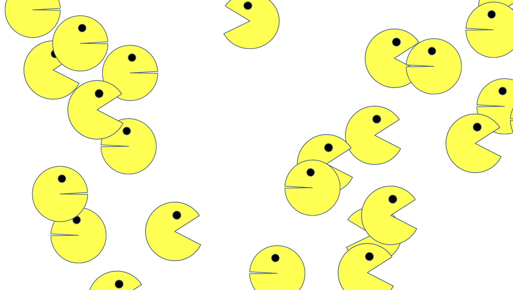

# Pacmen Bouncing
Spawn PacMan figures with random trajectory that bounce off the edges of your browser window

## Description of the project
Each PacMan has a random velocity (in x and y) and its position is updated each time update() is called. On update, each PacMan is checked for collision against the boundary walls of the browser window and the appearnance features a two frame looped animation that depends on whether it faces left or right.

This exercise showcases control over the DOM, adjusting CSS parameters with Javascript, and Javascript basics (functions, arrays, loops, and conditionals)

## How to Run
Download all files then open index.html in your browser

## Roadmap of future improvements
Create a "Slow down" function to remove the extra iterators created by "Speed Up"

Refine animation with more than just the two frames

## License

MIT License

Copyright (c) 2022 Taylor Farnham

Permission is hereby granted, free of charge, to any person obtaining a copy
of this software and associated documentation files (the "Software"), to deal
in the Software without restriction, including without limitation the rights
to use, copy, modify, merge, publish, distribute, sublicense, and/or sell
copies of the Software, and to permit persons to whom the Software is
furnished to do so, subject to the following conditions:

The above copyright notice and this permission notice shall be included in all
copies or substantial portions of the Software.

THE SOFTWARE IS PROVIDED "AS IS", WITHOUT WARRANTY OF ANY KIND, EXPRESS OR
IMPLIED, INCLUDING BUT NOT LIMITED TO THE WARRANTIES OF MERCHANTABILITY,
FITNESS FOR A PARTICULAR PURPOSE AND NONINFRINGEMENT. IN NO EVENT SHALL THE
AUTHORS OR COPYRIGHT HOLDERS BE LIABLE FOR ANY CLAIM, DAMAGES OR OTHER
LIABILITY, WHETHER IN AN ACTION OF CONTRACT, TORT OR OTHERWISE, ARISING FROM,
OUT OF OR IN CONNECTION WITH THE SOFTWARE OR THE USE OR OTHER DEALINGS IN THE
SOFTWARE.